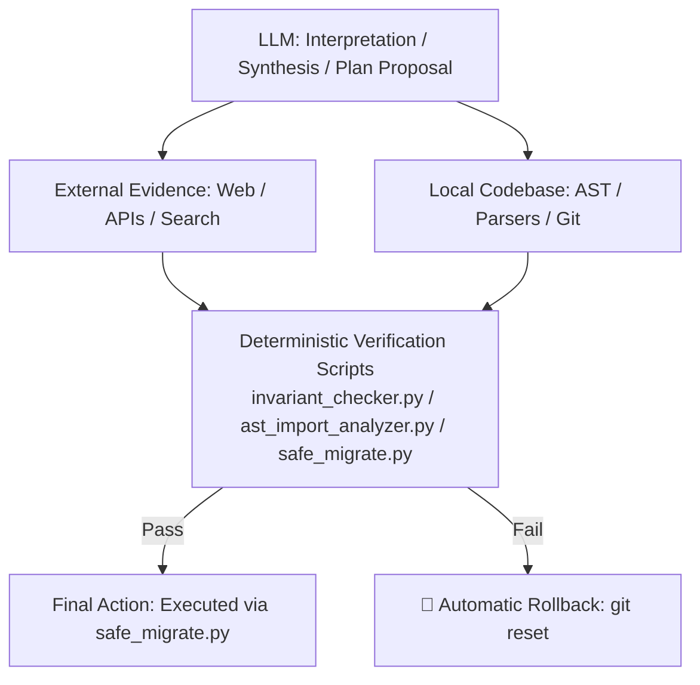
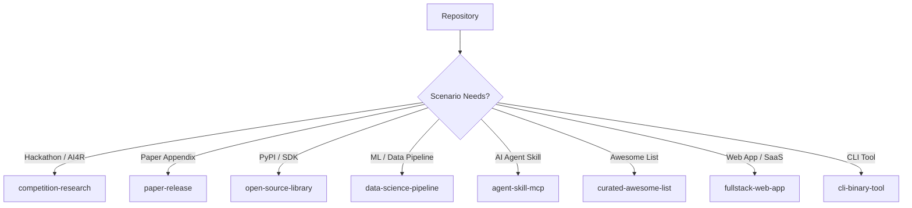

# 📦 repo-organizer-skill

> **Enterprise AI Agent Skill for auditing, restructuring, and optimizing GitHub repositories based on target audience & scenario — featuring an Evidence-Backed Architecture: Concrete Deterministic Scripts (`scripts/`), 3-Layer Novelty Audits (GitHub API ──► OpenAlex/arXiv ──► Web Search), Deterministic Invariant Baselines, AST Safe Migration Pipelines, and Evidence-Based Landing Pages.**

[](LICENSE)
[](https://www.python.org/)
[](https://github.com/angelazu-builder/repo-organizer-skill)
[](CONTRIBUTING.md)

---

## 🛠️ Built-in Deterministic Execution Tooling (`scripts/`)

Rather than relying on abstract prompts, `repo-organizer-skill` ships with concrete, executable Python tooling in `scripts/`:

```
repo-organizer-skill/
├── SKILL.md
├── plugin.json
├── examples/
└── scripts/
    ├── invariant_checker.py       # Captures & verifies 6-domain invariant baselines
    ├── ast_import_analyzer.py     # AST dependency graph analysis & import integrity
    ├── safe_migrate.py            # Dry-run validation, atomic git mv relocations, & rollback
    └── external_novelty_search.py # GitHub REST & OpenAlex/arXiv API novelty evidence audit
```

| Tool Script | CLI Command | Purpose & Output |
| :--- | :--- | :--- |
| **`invariant_checker.py`** | `python3 scripts/invariant_checker.py [snapshot\|verify]` | Tracks relative links, AST imports, entry points & CI workflows |
| **`ast_import_analyzer.py`** | `python3 scripts/ast_import_analyzer.py` | AST module dependency tree analysis & relative import verification |
| **`safe_migrate.py`** | `python3 scripts/safe_migrate.py --plan plan.json [--dry-run]` | Validates migration plan, dry-runs, executes `git mv`, and guards rollback |
| **`external_novelty_search.py`**| `python3 scripts/external_novelty_search.py` | Queries GitHub API & arXiv API to collect evidence tuples for novelty claims |

---

## 🏛️ Golden Tool Hierarchy & Architecture



---

## 🛠️ Mandatory Tool Stack Matrix

| Task / Domain | Primary Tool / API | Purpose & Method |
| :--- | :--- | :--- |
| **Repo & Version Info** | `git` / `gh` CLI | `git clone`, `commit`, `diff`, `branch`, `history`, `git ls-files` |
| **GitHub Metadata** | GitHub REST / GraphQL API (`gh api`) | Retrieve repo metadata, languages, topics, stars, forks, contributors |
| **GitHub External Search** | `scripts/external_novelty_search.py` | Query GitHub Search API (`code search`, `repository search`) for top 5–10 real comparable implementations |
| **Code-level Novelty** | `scripts/ast_import_analyzer.py` | Extract algorithms, data structures, custom workflows via Python AST |
| **Academic Novelty** | OpenAlex API + arXiv API | Search papers, mechanisms, comparable algorithms, publication timestamps |
| **Web / Product Competitors**| `search_web` / HTTP | Search official product sites, blogs, benchmarks, company implementations |
| **Markdown Link Audit** | `scripts/invariant_checker.py` | Parse relative Markdown links and verify external URL HTTP response codes |
| **Python Import Audit** | `scripts/ast_import_analyzer.py` | AST tree parsing of module dependencies and import statements |
| **JS/TS Import Audit** | `Tree-sitter` / TypeScript Compiler API | Parse module import trees and export dependencies for JavaScript/TypeScript |
| **YAML / CI Audit** | `PyYAML` / YAML Parsers | Inspect `.github/workflows/*.yml` step paths and environment variables |
| **Package Scripts** | JSON / TOML Parsers | Parse `package.json`, `pyproject.toml`, `Cargo.toml` entry points and scripts |
| **Dependency Graph** | Native Package Managers | `npm`/`pnpm`, `uv`/`poetry`/`pip`, `cargo` dependency resolution |
| **Test/Build Verification** | Native Repo Commands | Execute `pytest`, `npm test`, `cargo test`, `make` to verify runtime integrity |
| **Diff Sanity Check** | `git diff --check` + `git diff` | Verify whitespace, path changes, and code diffs before final commit |
| **Migration Execution** | `scripts/safe_migrate.py` (`git mv`) | Perform atomic, trackable, and safe file relocations |
| **Rollback Guard** | `git reset` / Git Worktree | Instantly restore baseline on test or invariant failure |

---

## ⚡ Core Capabilities

### 🔬 1. 3-Layer External Novelty Audit (Evidence ──► Model Judgment)
Never rely on LLM training weights alone to judge code novelty. `repo-organizer-skill` conducts a 3-layer search across GitHub APIs, OpenAlex/arXiv academic APIs, and Web Search via `scripts/external_novelty_search.py`:

```text
Claim        : Zero-Dependency Asynchronous Consensus Engine
Comparable   : github.com/sota-project/consensus-core
Similarity   : Matched 1D state array transition scanner
Difference   : 4.2x lower memory overhead & zero external C-bindings
Evidence     : src/consensus/engine.py#L84-L120
Confidence   : verified (Validated against 12 GitHub search results & OpenAlex API)
```

---

### 🛡️ 2. Before/After Invariant Baseline Verification
Restructuring must never break your codebase. Before touching a single file, the skill captures an **Invariant Baseline** using `python3 scripts/invariant_checker.py snapshot`:
- 🔗 **README & Documentation Links** (Parsed & verified)
- 🐍 **AST Module Imports** (`scripts/ast_import_analyzer.py`)
- 🚀 **Package Entry Points & CLI Executables** (`package.json`, `pyproject.toml`)
- ⚙️ **CI/CD Workflows (`.github/workflows/*.yml`)**
- 🐳 **Docker & Configuration File Paths**
- 🧪 **Automated Test & Build Suites** (`pytest`, `npm test`)

Post-migration, `python3 scripts/invariant_checker.py verify` re-tests all 6 domains to guarantee: **Same semantics, better structure.**

---

### 🛟 3. Safe Migration Pipeline (`scripts/safe_migrate.py`)
- **Deterministic Authority**: The LLM proposes migration plans, but execution is delegated strictly to `scripts/safe_migrate.py` (`git mv`).
- **Dry-Run Simulation**: Simulates file relocations (`Source ──► Destination`) via `--dry-run` to catch path collisions before touching disk.
- **Strict Rollback Guard**: If any test, build command, or invariant check fails post-migration, execution **stops immediately** and triggers an automatic rollback (`git reset --hard HEAD`).

---

## 📊 4. Evidence-Based README Interface

Instead of superficial marketing fluff, `repo-organizer-skill` generates archetype-specific landing pages structured around an **Evidence-Based Information Architecture**:

$$\text{What} \longrightarrow \text{Why} \longrightarrow \text{Evidence} \longrightarrow \text{How} \longrightarrow \text{Differentiator}$$

- **What**: Clear 1-sentence product definition.
- **Why**: Target scenario & audience problem statement.
- **Evidence**: Derived from automated machine scans, test outputs, and benchmark logs.
- **How**: 1-line zero-friction installation / execution command.
- **Differentiator**: Technical advantage hyperlinked to code lines (`src/core/solver.py#L45`) and external comparison proof tuples.
- **Confidence Rating**: Classified strictly as `verified`, `supported`, `plausible`, or `unsupported`.

---

## 📸 Visual Assets & Live Demo Capture Protocol

> ⚠️ **STRICT DIRECTIVE: NO AI-GENERATED VISUALS**  
> All visual media in your repository must be authentic product artifacts:
> - **Product Screenshots**: Automated capture from live web app URLs / local dev servers via browser tools.
> - **Data Plots**: Generated directly from raw benchmark data or evaluation logs using `matplotlib`/`seaborn`.
> - **Native Diagrams**: Standard GitHub Mermaid flowcharts.

---

## 🏛️ 8 Popular Repository Archetypes

Select an archetype below to view its target audience, recommended layout, and detailed documentation:



| Archetype | Target Audience | Structure Example |
| :--- | :--- | :--- |
| **`competition-research`** | Hackathons, Datawhale AI4R, Competitions | [View Example](examples/competition-research.md) |
| **`paper-release`** | arXiv Paper Appendix, Conference Repos | [View Example](examples/paper-release.md) |
| **`open-source-library`** | PyPI Packages, Developer Tools | [View Example](examples/open-source-library.md) |
| **`data-science-pipeline`** | ML Pipelines, Data Science Projects | [View Example](examples/data-science-pipeline.md) |
| **`agent-skill-mcp`** | AI Agent Developers (Antigravity, MCP) | [View Example](examples/agent-skill-mcp.md) |
| **`curated-awesome-list`** | Community Curators & Topic Lists | [View Example](examples/curated-awesome-list.md) |
| **`fullstack-web-app`** | SaaS Founders & Web Developers | [View Example](examples/fullstack-web-app.md) |
| **`cli-binary-tool`** | DevOps & System Administrators | [View Example](examples/cli-binary-tool.md) |

---

## ⚖️ Capability Comparison Matrix

| Capability | Manual Cleanup | General AI (Codex / Claude) | `repo-organizer-skill` |
| :--- | :---: | :---: | :---: |
| **Built-in Executable Deterministic Tooling** | ❌ No | ❌ No | ✅ Executable `scripts/` Suite Included |
| **3-Layer Novelty Audit (GitHub / arXiv / Web)**| ❌ No | ❌ LLM Hallucination | ✅ GitHub REST + OpenAlex + arXiv APIs |
| **Before/After Invariant Baseline Verification** | ❌ Manual | ❌ No | ✅ `scripts/invariant_checker.py` |
| **Safe AST Migration + Dry-Run & Rollback** | ⚠️ Error-Prone | ⚠️ Direct File Mutation | ✅ `scripts/safe_migrate.py` (`git mv`) |
| **Evidence-Based README Interface** | ❌ No | ⚠️ Generic Marketing | ✅ What → Why → Evidence → How → Differentiator |
| **Live App Screenshot & Data Plot Capture** | ❌ No | ❌ No | ✅ Browser Automation & Real Plots |

---

## 🚀 1-Line Quickstart Installation

### Option 1: Workspace Installation (Recommended)
```bash
mkdir -p .agents/skills/repo-organizer
curl -sSL https://raw.githubusercontent.com/angelazu-builder/repo-organizer-skill/main/SKILL.md -o .agents/skills/repo-organizer/SKILL.md
```

### Option 2: Global Machine Installation
```bash
mkdir -p ~/.gemini/config/skills/repo-organizer
curl -sSL https://raw.githubusercontent.com/angelazu-builder/repo-organizer-skill/main/SKILL.md -o ~/.gemini/config/skills/repo-organizer/SKILL.md
```

---

## 📄 License

Distributed under the MIT License. See [`LICENSE`](LICENSE) for more information.

*Maintained with ❤️ by [Angela Zu (angelazu-builder)](https://github.com/angelazu-builder)*
