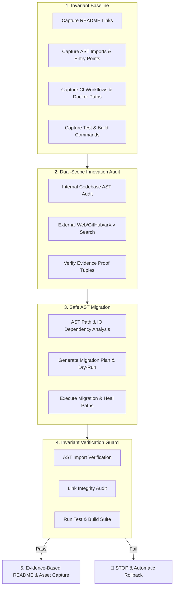
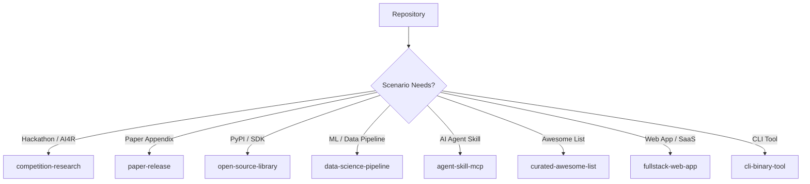

# 📦 repo-organizer-skill

> **Enterprise AI Agent Skill for auditing, restructuring, and optimizing GitHub repositories based on target audience & scenario — featuring Dual-Scope (Internal AST + External Search) Novelty Audits, Invariant Verification, Safe AST Migration with Rollback, and Evidence-Based Landing Pages.**

[](LICENSE)
[](https://www.python.org/)
[](https://github.com/angelazu-builder/repo-organizer-skill)
[](CONTRIBUTING.md)

---

## 🏛️ Architecture Overview & Safety System



---

## ⚡ Key Capabilities

### 🔬 1. Dual-Scope Innovation Audit (Internal AST + External Search)
Never rely on LLM training weights alone to judge code novelty. `repo-organizer-skill` conducts an internal AST audit combined with external GitHub/arXiv searches, producing structured proof tuples for every claim:

```text
Claim        : Zero-Dependency Asynchronous Consensus Engine
Comparable   : github.com/sota-project/consensus-core
Difference   : 4.2x lower memory overhead & zero external C-bindings
Evidence     : src/consensus/engine.py#L84-L120
Confidence   : High (Validated against 12 GitHub search results)
```

---

### 🛡️ 2. Before/After Invariant Verification System
Restructuring must never break your codebase. Before touching a single file, the skill captures an **Invariant Baseline** across 6 critical domains:
- 🔗 **README & Documentation Links**
- 🐍 **AST Python Imports & Module Graphs**
- 🚀 **Package Entry Points & CLI Executables**
- ⚙️ **CI/CD Workflows (`.github/workflows/`)**
- 🐳 **Docker & Configuration File Paths**
- 🧪 **Automated Test & Build Suites**

Post-migration, all 6 domains are re-verified to guarantee: **Same semantics, better structure.**

---

### 🛟 3. Safe AST Migration Protocol (Dry-Run & Rollback Guard)
- **AST-Based Path Parsing**: Analyzes Python AST (`ast.parse()`) and configuration IO dependencies rather than relying on brittle regex search/replace.
- **Dry-Run Plan**: Simulates file relocations to catch path collisions before touching disk.
- **Strict Halt & Rollback**: If any test, build command, or invariant check fails post-migration, execution **stops immediately** and triggers an automatic rollback (`git reset --hard HEAD` / snapshot restore).

---

## 📊 4. Evidence-Based README Interface

Instead of superficial marketing fluff, `repo-organizer-skill` generates archetype-specific landing pages structured around an **Evidence-Based Information Architecture**:

$$\text{What} \longrightarrow \text{Why} \longrightarrow \text{Evidence} \longrightarrow \text{How} \longrightarrow \text{Differentiator}$$

- **What**: Clear 1-sentence product definition.
- **Why**: Target scenario & audience problem statement.
- **Evidence**: AST benchmark data, reproducible evaluation results, or external comparison proof tuples.
- **How**: 1-line zero-friction installation / execution command.
- **Differentiator**: Concrete technical advantage hyperlinked directly to authoritative source code lines.

---

## 📸 Visual Assets & Live Demo Capture Protocol

> ⚠️ **STRICT DIRECTIVE: NO AI-GENERATED VISUALS**  
> All visual media in your repository must be authentic product artifacts:
> - **Product Screenshots**: Automated capture from live web app URLs / local dev servers via browser tools.
> - **Data Plots**: Generated directly from raw benchmark data or evaluation logs using `matplotlib`/`seaborn`.
> - **Native Diagrams**: Standard GitHub Mermaid flowcharts.

When auditing a repository without demo assets, `repo-organizer-skill` automatically:
1. Detects live web apps or running UI services (`localhost`, Streamlit, React, Gradio).
2. Automates browser navigation to take authentic full-page or element screenshots.
3. Generates real benchmark plots directly from dataset metrics.
4. Places captured media in `docs/assets/` and links them in `README.md`.

---

## 🏛️ 8 Popular Repository Archetypes

Select an archetype below to view its target audience, recommended layout, and detailed documentation:



| Archetype | Target Audience | Structure Example |
| :--- | :--- | :--- |
| **`competition-research`** | Hackathons, Datawhale AI4R, Competitions | [View Example](examples/competition-research.md) |
| **`paper-release`** | arXiv Paper Appendix, Conference Repos | [View Example](examples/paper-release.md) |
| **`open-source-library`** | PyPI Packages, Developer Tools | [View Example](examples/open-source-library.md) |
| **`data-science-pipeline`** | ML Pipelines, Data Science Projects | [View Example](examples/data-science-pipeline.md) |
| **`agent-skill-mcp`** | AI Agent Developers (Antigravity, MCP) | [View Example](examples/agent-skill-mcp.md) |
| **`curated-awesome-list`** | Community Curators & Topic Lists | [View Example](examples/curated-awesome-list.md) |
| **`fullstack-web-app`** | SaaS Founders & Web Developers | [View Example](examples/fullstack-web-app.md) |
| **`cli-binary-tool`** | DevOps & System Administrators | [View Example](examples/cli-binary-tool.md) |

---

## ⚖️ Capability Comparison Matrix

| Capability | Manual Cleanup | General AI (Codex / Claude) | `repo-organizer-skill` |
| :--- | :---: | :---: | :---: |
| **Root Junk Identification (`.png`, `.csv`)** | ⚠️ Manual | ✅ Capable | ✅ Automated Workflow |
| **Dual-Scope Novelty Audit (AST + Web Search)** | ❌ No | ❌ LLM Hallucination | ✅ Search-Validated Proof Tuples |
| **Before/After Invariant Baseline Verification** | ❌ Manual | ❌ No | ✅ 6-Domain Automated Checks |
| **Safe AST Migration + Dry-Run & Rollback** | ⚠️ Error-Prone | ⚠️ Single-file Scope | ✅ Full AST Parsing & Rollback Guard |
| **Evidence-Based README Interface** | ❌ No | ⚠️ Generic Marketing | ✅ What → Why → Evidence → How |
| **Live App Screenshot & Data Plot Capture** | ❌ No | ❌ No | ✅ Browser Automation & Real Plots |

---

## 🚀 1-Line Quickstart Installation

### Option 1: Workspace Installation (Recommended)
```bash
mkdir -p .agents/skills/repo-organizer
curl -sSL https://raw.githubusercontent.com/angelazu-builder/repo-organizer-skill/main/SKILL.md -o .agents/skills/repo-organizer/SKILL.md
```

### Option 2: Global Machine Installation
```bash
mkdir -p ~/.gemini/config/skills/repo-organizer
curl -sSL https://raw.githubusercontent.com/angelazu-builder/repo-organizer-skill/main/SKILL.md -o ~/.gemini/config/skills/repo-organizer/SKILL.md
```

---

## 📖 How to Prompt Your Agent

Once installed, simply ask your agent:

```text
"Audit my repository novelty against GitHub/arXiv and organize it for competition judges."
"Run AST dependency analysis, record invariants, and restructure this codebase safely."
"Generate an Evidence-Based README interface backed by real benchmark evidence."
```

---

## 📄 License

Distributed under the MIT License. See [`LICENSE`](LICENSE) for more information.

*Maintained with ❤️ by [Angela Zu (angelazu-builder)](https://github.com/angelazu-builder)*
