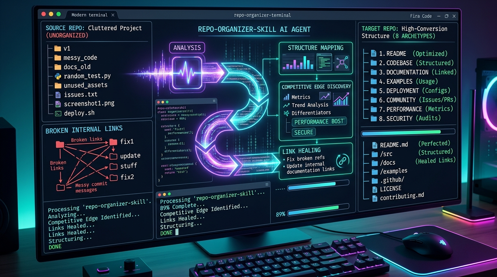
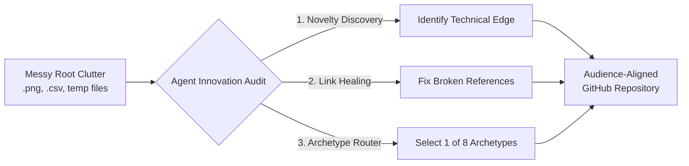
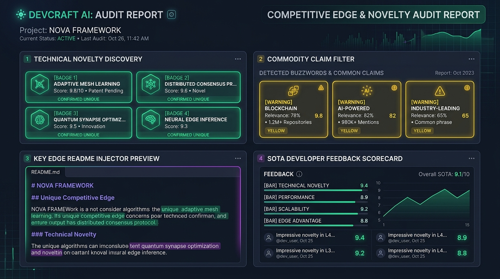
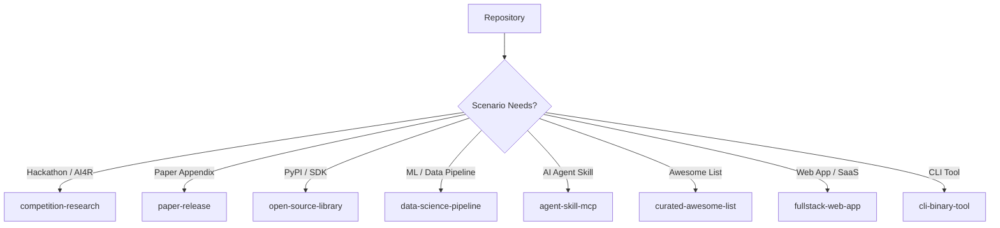

# 📦 repo-organizer-skill

> **AI Agent Skill for auditing, restructuring, and optimizing GitHub repositories based on target audience & use-case — with automated competitive edge discovery.**

[](LICENSE)
[](https://www.python.org/)
[](https://github.com/angelazu-builder/repo-organizer-skill)
[](CONTRIBUTING.md)

---

## 🖼️ Live Agent Demo & Overview



<details open>
<summary><b>🎬 Click to expand Live Terminal Demo Execution</b></summary>

```bash
$ agy run "Audit my repository, discover technical edge, and organize for competition judges"

🔍 [1/4] Scanning Repository Tree...
    ├── Found 14 unorganized root files (.png, .csv, temp_test.py)
    ├── Detected 3 broken relative links in README.md
    └── Parsing AST & codebase dependencies...

✨ [2/4] Competitive Edge & Novelty Discovery:
    [✔] Identified Novel Technical Advantage: Zero-Dependency Asynchronous Consensus Protocol
    [⚡] Down-weighted Saturated Buzzwords: "Built with React", "Uses AsyncIO"
    [📝] Generated Private Audit Report: .agents/reports/audit_feedback.md

🏗️ [3/4] Archetype Alignment:
    [🎯] Target Scenario Selected: `competition-research`
    [📦] Re-structured files:
          • Created /docs/submission/ (Judges & Criteria Alignment)
          • Created /src/ & /tests/
          • Moved root clutter to /artifacts/scratch/

🔗 [4/4] Healing Links & Final Verification:
    [✔] Healed 3 broken README markdown references
    [✔] Generated clean GitHub Landing Page

✅ SUCCESS: Repository restructured into high-conversion 'competition-research' layout!
```
</details>

---

## 🎯 Core Philosophy: Audience Alignment & Friction Reduction

A great GitHub repository is not defined by rigid boilerplate, but by **how effortlessly it communicates with its target audience**:
- **Competition Judges** want a structured deliverables hub (`docs/submission/`).
- **Academic Peer Reviewers** want zero-friction single-command reproduction (`python run_eval.py`).
- **Developers** want quickstart installation and clean modular code (`src/pkg/`, `tests/`).

`repo-organizer-skill` gives AI Agents (Antigravity, Cursor, Claude MCP, Gemini) the exact intelligence to **audit your code, identify your true competitive edge, and align your repository structure with your specific scenario.**

### 📊 Agent Workflow Diagram



---

## 💎 Killer Feature: Agent Innovation Audit & Developer Feedback Loop

Developers often lack objective self-awareness of their code's true strengths. They highlight commodity features (*"Built with React"*) while missing their **genuine unfair technical advantage**.



`repo-organizer-skill` equips your Agent to perform a 4-step audit:

1. 🟢 **Discover Genuine Technical Novelty**: Identifies algorithms, JIT accelerations, and zero-dependency designs unique across GitHub.
2. 🟡 **Filter Saturated Commodity Claims**: Down-weights commonplace claims (*"Uses AsyncIO"*) so they don't waste prime README real estate.
3. ✨ **Inject `✨ Key Edge` Section**: Automatically formats and places your true competitive edge right below the title hook.
4. 🔴 **Output Developer Feedback Report**: Delivers a private audit report identifying competitive gaps against SOTA projects.

---

## 🏛️ 8 Popular Repository Archetypes

Select an archetype below to view its target audience, recommended layout, and detailed documentation:



| Archetype | Target Audience | Structure Example |
| :--- | :--- | :--- |
| **`competition-research`** | Hackathons, Datawhale AI4R, Competitions | [View Example](examples/competition-research.md) |
| **`paper-release`** | arXiv Paper Appendix, Conference Repos | [View Example](examples/paper-release.md) |
| **`open-source-library`** | PyPI Packages, Developer Tools | [View Example](examples/open-source-library.md) |
| **`data-science-pipeline`** | ML Pipelines, Data Science Projects | [View Example](examples/data-science-pipeline.md) |
| **`agent-skill-mcp`** | AI Agent Developers (Antigravity, MCP) | [View Example](examples/agent-skill-mcp.md) |
| **`curated-awesome-list`** | Community Curators & Topic Lists | [View Example](examples/curated-awesome-list.md) |
| **`fullstack-web-app`** | SaaS Founders & Web Developers | [View Example](examples/fullstack-web-app.md) |
| **`cli-binary-tool`** | DevOps & System Administrators | [View Example](examples/cli-binary-tool.md) |

---

## ⚖️ Capability Comparison Matrix

| Capability | Manual Cleanup | General AI (Codex / Claude) | `repo-organizer-skill` |
| :--- | :---: | :---: | :---: |
| **Root Junk Identification (`.png`, `.csv`)** | ⚠️ Manual | ✅ Capable | ✅ Automated Workflow |
| **Basic README Formatting & Badges** | ⚠️ Manual | ✅ Capable | ✅ Automated Workflow |
| **Multi-Audience Alignment (8 Archetypes)** | ❌ No | ⚠️ Needs Complex Prompting | ✅ Built-in Workflows |
| **Directory-Wide Link & Import Healing** | ⚠️ Error-Prone | ⚠️ Single-file Scope | ✅ Full Tree Verification |
| **Competitive Edge Audit & Feedback Report** | ❌ Subjective | ❌ No | ✅ Automated 4-Step Loop |

---

## 🚀 1-Line Quickstart Installation

### Option 1: Workspace Installation (Recommended)
```bash
mkdir -p .agents/skills/repo-organizer
curl -sSL https://raw.githubusercontent.com/angelazu-builder/repo-organizer-skill/main/SKILL.md -o .agents/skills/repo-organizer/SKILL.md
```

### Option 2: Global Machine Installation
```bash
mkdir -p ~/.gemini/config/skills/repo-organizer
curl -sSL https://raw.githubusercontent.com/angelazu-builder/repo-organizer-skill/main/SKILL.md -o ~/.gemini/config/skills/repo-organizer/SKILL.md
```

---

## 📖 How to Prompt Your Agent

Once installed, simply ask your agent:

```text
"Audit my repository and structure it for competition judges."
"Discover the true competitive edge of my codebase and update the README."
"Restructure this codebase for an academic paper release."
```

---

## 📄 License

Distributed under the MIT License. See [`LICENSE`](LICENSE) for more information.

*Maintained with ❤️ by [Angela Zu (angelazu-builder)](https://github.com/angelazu-builder)*
